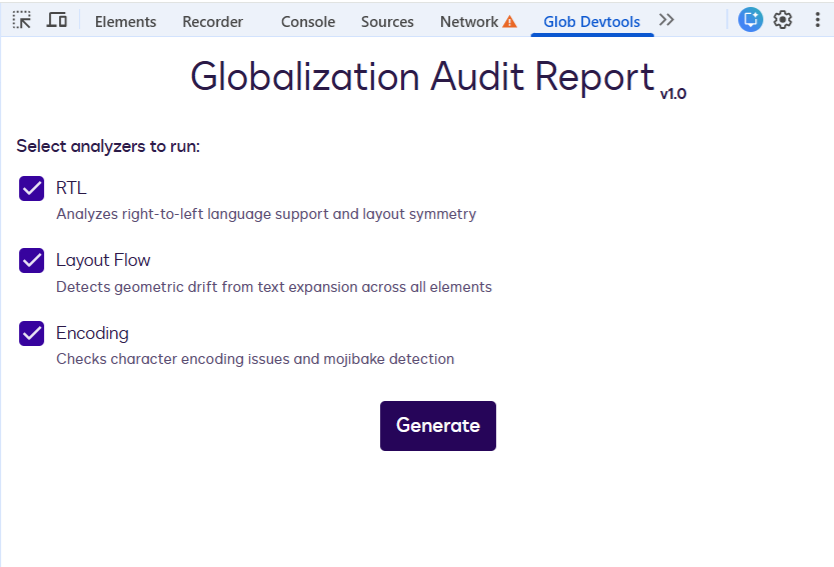
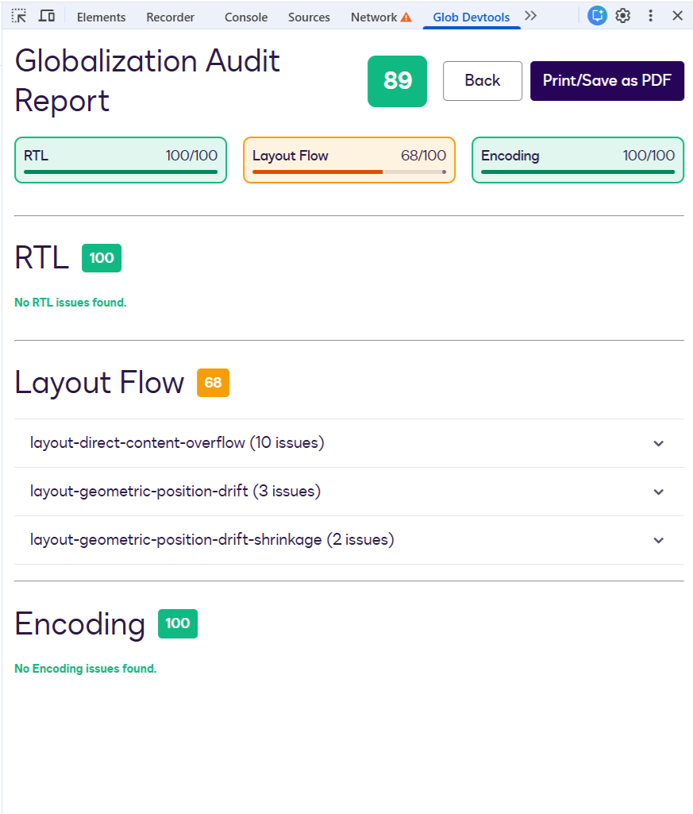
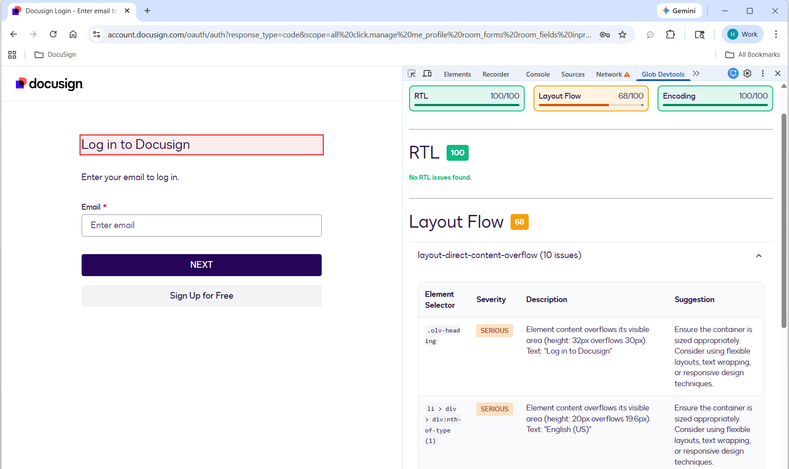

# Pangaea DevTools Extension

<div>
  
</div>

A Chrome DevTools extension for auditing web applications for globalization issues including RTL
support, layout flow, and text encoding.

## Development

### Build the Extension

```bash
# From the root of the monorepo
yarn build

# Or build just the devtools-extension package
cd packages/devtools-extension
yarn build
```

## Loading the Extension in Chrome

### Step 1: Build the Extension

Make sure you've built the extension first (see above).

### Step 2: Open Chrome Extensions Page

1. Open Chrome browser
2. Navigate to `chrome://extensions/`
3. Enable "Developer mode" using the toggle in the top-right corner

### Step 3: Load the Extension

1. Click the "Load unpacked" button
2. Navigate to and select the `packages/devtools-extension/dist` folder
3. The extension should now appear in your extensions list

### Step 4: Using the Extension

1. Open Chrome DevTools (F12 or Right-click → Inspect)
2. Look for the "Globalization Audit" tab in the DevTools panel
3. Configure your audit settings and click "Run Audit"
4. View the results and download PDF reports as needed

<div>
  
</div>

<div>
  
</div>

## Features

- **RTL Analysis**: Detects RTL layout issues and missing `dir` attributes
- **Layout Flow Analysis**: Identifies hardcoded layout properties that may break in different
  languages
- **Encoding Analysis**: Finds encoding issues and problematic character usage
- **Interactive Reports**: Click on issues to highlight elements in the page
- **PDF Export**: Generate and download PDF reports of your audit results

## Troubleshooting

### Extension Not Showing in DevTools

- Make sure the extension is enabled in `chrome://extensions/`
- Try closing and reopening DevTools
- Check that the build was successful and the `dist` folder exists

### Audit Gets Stuck

- The extension includes a 30-second timeout for audits
- If a page navigation occurs during an audit, the extension will automatically reconnect

### PDF Export Not Working

- Make sure pop-ups are not blocked for the DevTools window
- The PDF is generated by opening a new window - check your browser settings
